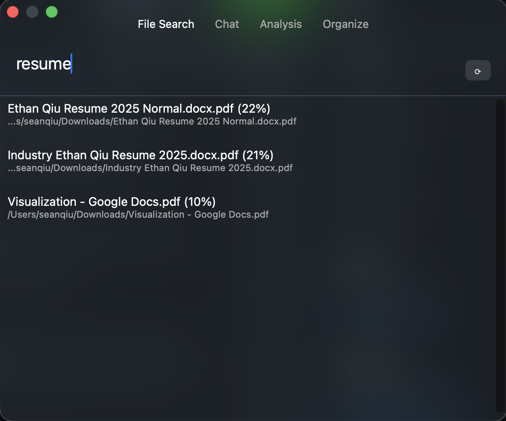

# Desktop Searcher

A python Mac app that acts as a better search for your files. Currently working on  analysis dashboard on download time, type of file, and also implementing a chat that essentially works as a Copilot for Mac users. 

## Features

- **Filesystem watcher**: Monitors Downloads (or any folder) for new files
- **Text extraction**: PDFs, Word docs, markdown, notebooks, code files and embeds using Sentence Transformer
- **DuckDB storage**: Fast local database for metadata + embeddings
- **Semantic search**


📖 **[Full Documentation](docs/IMPLEMENTATION.md)** | **[Usage Guide](docs/USAGE.md)**

## How it works

```
New file in Downloads → Extract text → Generate embedding → Store in DuckDB → Semantic search → open up  
```



*The main search interface with semantic search results and navigation tabs.*

## Quick Start

### Install Dependencies
First, install all required Python packages:
```bash
uv sync
```

### Launch Search App
Launch the transparent desktop search interface:
```bash
./run_brain.sh
```
Or directly via Python:
```bash
python src/brain_native.py
```

This opens a floating, transparent window where you can:
- Type to search your indexed files instantly
- Click results to reveal them in Finder
- Press `Esc` or close the window to quit


